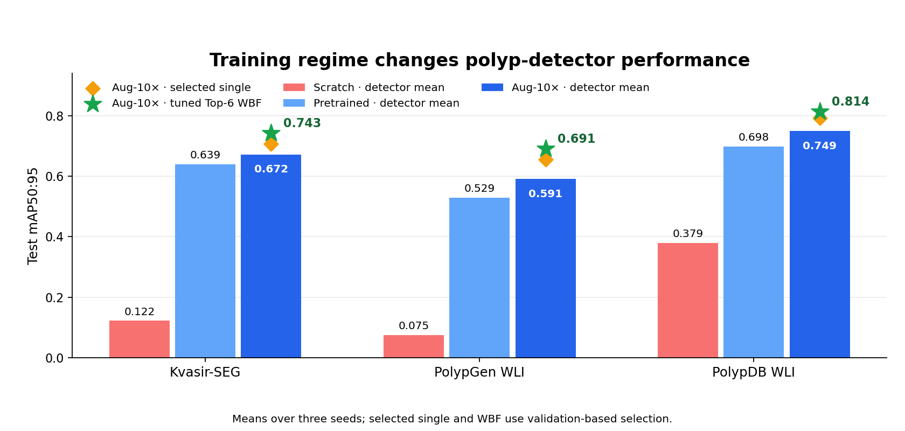

# PolypRegimeBench

**Training regime shapes detector rankings and ensemble gains in white-light polyp detection.**

This project benchmarks 12 detection architectures across Kvasir-SEG, PolypGen-WLI, and PolypDB-WLI. Each architecture was evaluated with three training seeds under six conditions: scratch, pretrained baseline, 3×, 5×, and 10× offline augmentation, and a 5× repetition control. It includes code for the split protocol, augmentation, single-model training, cached prediction export, and ensemble analysis.

The study's central result is that training regime changes detector rankings. The project also compares hard voting and weighted boxes fusion against selected single models and reports inference cost. These are retrospective research benchmarks, not clinical validation.

## Results at a glance

Test $\mathrm{mAP}_{50:95}$, averaged over three model seeds. The first three columns are means across all 12 detectors. The selected single detector and tuned Top-6 weighted boxes fusion (WBF) use validation-based selection under Aug-10×.

| Test dataset | Scratch mean | Pretrained mean | Aug-10× mean | Selected single | Tuned WBF |
| --- | ---: | ---: | ---: | ---: | ---: |
| Kvasir-SEG | 0.122 | 0.639 | 0.672 | 0.707 | **0.743** |
| PolypGen WLI | 0.075 | 0.529 | 0.591 | 0.655 | **0.691** |
| PolypDB WLI | 0.379 | 0.698 | 0.749 | 0.792 | **0.814** |



Pretraining changed the detector ranking substantially: RT-DETR-X rose from 10th–12th under scratch training to first or second in all 15 pretrained regime–dataset combinations. Tuned WBF exceeded the best individual detector in 13 of those 15 combinations. At 640×640 on the shared H200 NVL used in this study, RT-DETR-X took 35.6 ms/frame (28.1 FPS); serial Top-6 WBF took about 137–143 ms/frame (7.0–7.3 FPS). These timings are indicative, not a controlled hardware comparison. Detailed per-run metrics and prediction exports are in the [model repository](https://huggingface.co/AI-for-Medicine-and-Health/polyp-regime-bench-models).

### Predictions on original endoscopy frames

The figure below uses two **Kvasir-SEG test images**. Each row shows the unmodified source frame, the reference lesion box, and RT-DETR-X predictions from three training regimes (seed 88). Green is the reference box; cyan is a matched prediction; pink is an unmatched prediction. Detections use score >0.20 and matching uses IoU ≥0.50. The two images were selected to illustrate a training-regime effect; they do not estimate typical accuracy.


Image source: [Kvasir-SEG, Simula Research Laboratory](https://datasets.simula.no/kvasir-seg/) (Jha et al., *Kvasir-SEG: A Segmented Polyp Dataset*, MMM 2020). Its published terms restrict use to research and education, require citation, and require prior written permission for commercial use. Example test image IDs: `19fbdf4d-bf29-4a07-831c-3742f7495e57` and `b0cad6a8-03a0-43cd-bf8e-86eeed830d4b`. Other original dataset images are not redistributed here.

## Repositories

- Code and project documentation: `AI-for-Medicine-and-Health/polyp-regime-bench` (this repository)
- Data manifests and source instructions: `AI-for-Medicine-and-Health/polyp-regime-bench-data` on Hugging Face
- Model checkpoints and cached predictions: `AI-for-Medicine-and-Health/polyp-regime-bench-models` on Hugging Face

The dataset repository contains manifests, not copies of third-party endoscopy images. Obtain the images from the original publishers and follow their terms. The model repository contains the 648 completed canonical `best.pt` checkpoints and per-image prediction exports. Check the Hub repository cards for the exact published revision and files.

## Quick start

Python 3.10 and a PyTorch installation appropriate for your CPU or CUDA version are recommended. The original runs used PyTorch 2.5.1, Torchvision 0.20.1, and Ultralytics 8.4.130. Install those first using the [official PyTorch selector](https://pytorch.org/get-started/locally/), then:

```bash
python -m venv .venv
source .venv/bin/activate
python -m pip install -r requirements.txt
python tools/download.py manifests
python tools/download.py model --condition pretrained_aug10x --seed 88 --dataset kvasir_seg --model rtdetr_x
python tools/verify.py --condition pretrained_aug10x --seed 88 --dataset kvasir_seg --model rtdetr_x
python tools/infer.py --checkpoint models/checkpoints/pretrained_aug10x/seed88/kvasir_seg/rtdetr_x/best.pt --source /path/to/image.jpg
```

For the dataset preparation protocol, place the officially downloaded Kvasir-SEG, PolypGen and PolypDB files in the expected `datasets/raw/` subdirectories, then run `python tools/prepare_data.py --check` followed by `python tools/prepare_data.py --base`. Augmentation is an explicit additional step: `python tools/prepare_data.py --augment`. It takes substantial disk space. The source and manifest paths are documented in the dataset card.

Single-model training uses the original experiment entry point. Check prerequisites without launching a job:

```bash
python scripts/experiments/kvasir_seg__polypgen_wli__polypdb_wli__seed42_training/pretrain/common/train_one.py \
  --dataset kvasir_seg --model rtdetr_x --condition pretrained_aug10x --seed 88 --check-only
```

Remove `--check-only` only after providing the dataset and the corresponding original pretrained weights in `assets/pretrained_weights/`. The training script writes to `runs/training/` and skips completed runs. For scratch training, use the corresponding `scratch/common/train_one.py` entry point.

## Reproducibility and attribution

The split seed is 42 and model seeds are 88, 123, and 666. All 648 canonical training runs completed. The release index associates each checkpoint with its condition, dataset, model, seed, size and SHA-256. Source dataset licenses and citation instructions are controlled by their publishers; do not assign this repository's future software license to those data. The study manuscript and author citation will be linked after publication review.
