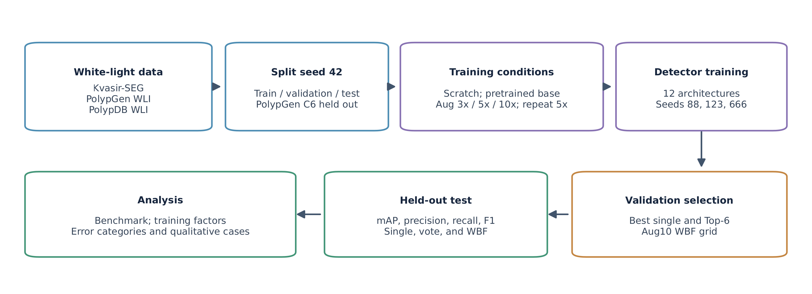
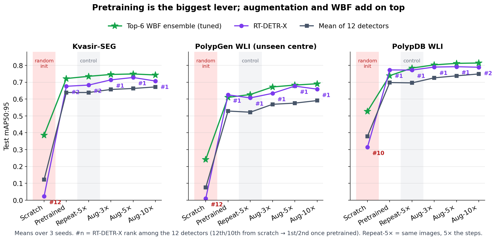
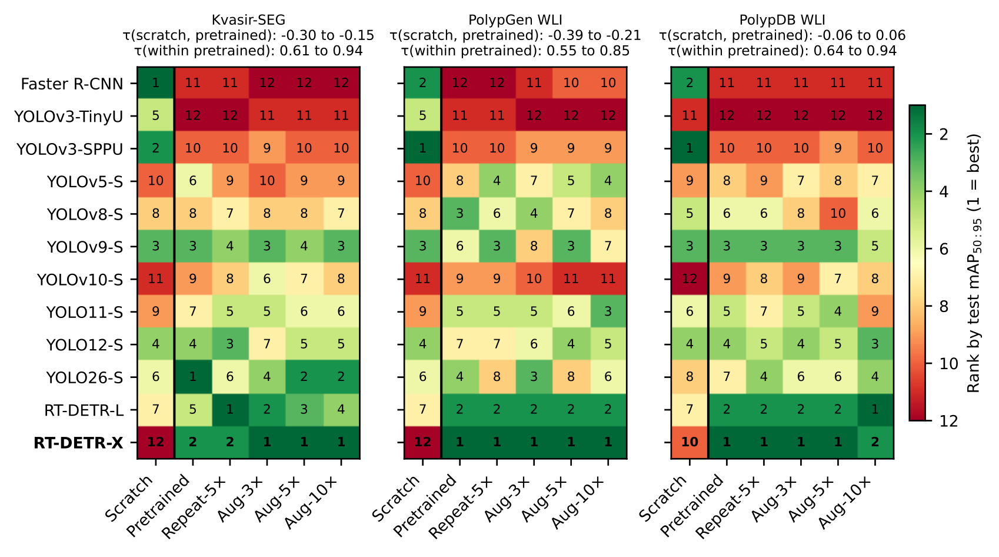
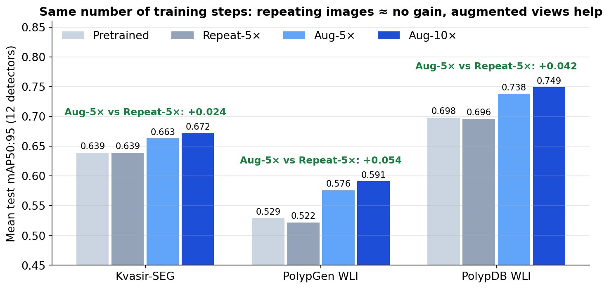
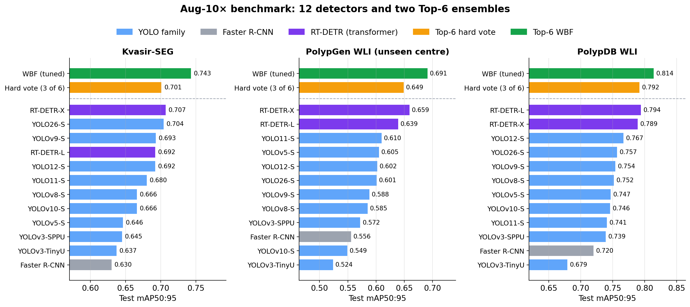
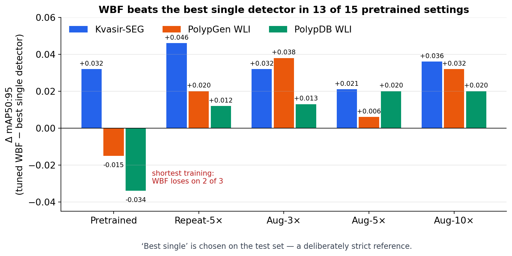
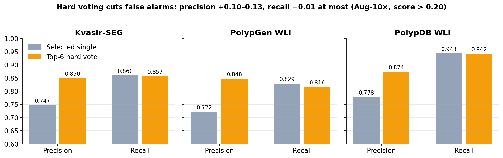
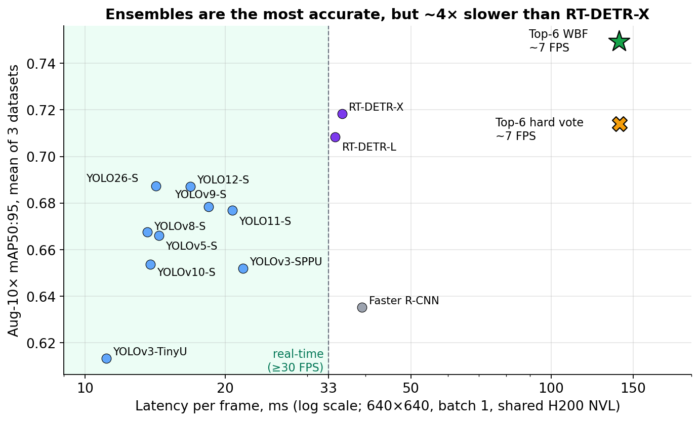
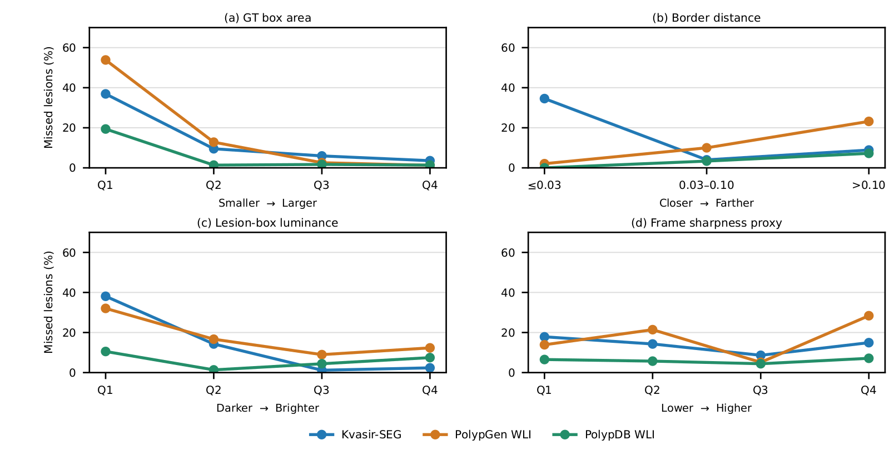
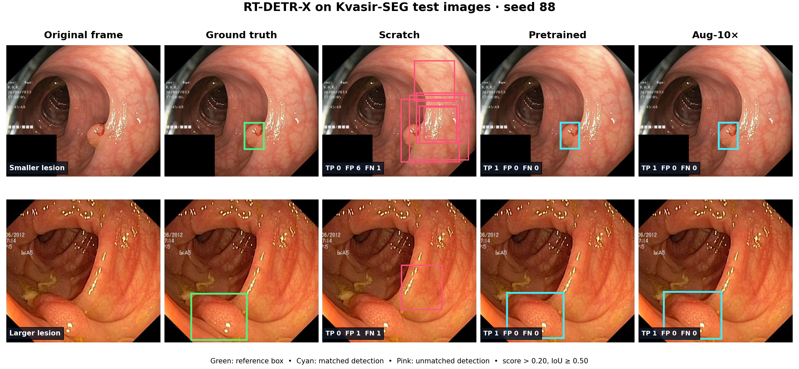

# PolypRegimeBench

**Does the "best" polyp detector stay the best if you train it differently?**
A controlled benchmark of 12 object detectors × 3 white-light colonoscopy datasets × 6 training regimes × 3 seeds = **648 trained models**, all released.

[📄 Paper (under review)](#citation) · [🤗 Checkpoints & predictions](https://huggingface.co/AI-for-Medicine-and-Health/polyp-regime-bench-models) · [🤗 Split & augmentation manifests](https://huggingface.co/datasets/AI-for-Medicine-and-Health/polyp-regime-bench-data)

> Research benchmark on retrospective still images. Not a clinically validated device.

---

## TL;DR — four findings

| # | Finding | Evidence |
|---|---|---|
| 1 | **Initialization flips the leaderboard.** | RT-DETR-X ranks **12th / 12th / 10th** when trained from scratch, but **1st or 2nd in all 15** pretrained settings. Kendall's τ between scratch and pretrained rankings is −0.39 to 0.06 (unrelated or reversed). |
| 2 | **Augmentation helps through new views, not extra training.** | Repeating each image 5× (same number of steps as Aug-5×) gives **no gain**; Aug-5× adds **+0.024 / +0.054 / +0.042** mAP50:95 over that control. |
| 3 | **Ensemble gains depend on how well the members are trained.** | Tuned Top-6 WBF beats the best single detector in **13 of 15** pretrained settings and fails only with the shortest training. Hard voting mostly buys precision (+0.10–0.13) rather than AP. |
| 4 | **Accuracy costs speed.** | RT-DETR-X: **35.6 ms (28 FPS)**. Top-6 ensembles: **~140 ms (~7 FPS)**, i.e. not real-time when run serially. |

**Practical takeaway:** use pretrained weights first; tune augmentation scale per architecture; use WBF when accuracy matters more than speed; and **always report the training regime** when comparing detectors.

---

## Study design



Everything that can be held fixed is held fixed: the split (seed 42), image modality (white-light only), evaluation code, input size (640), and training budget (25 epochs). Only the **training regime** and the **inference-time fusion** vary.

<table>
<tr><td valign="top">

**Datasets** (images, train / val / test)

| Dataset | Train | Val | Test | Test type |
|---|---:|---:|---:|---|
| Kvasir-SEG | 700 | 200 | 100 | random split |
| PolypGen WLI | 1,161 | 288 | 88 | **unseen centre (C6)** |
| PolypDB WLI | 2,870 | 359 | 359 | centre-stratified |

</td><td valign="top">

**Training regimes**

| Regime | What changes |
|---|---|
| Scratch | random initialization |
| Pretrained | public pretrained weights, original images |
| Aug-3× / 5× / 10× | + offline augmented copies (nested sets) |
| Repeat-5× | each original image ×5 — **control**: same steps as Aug-5×, no new views |

</td></tr>
</table>

**12 detectors:** Faster R-CNN (R50-FPN) · YOLOv3-TinyU · YOLOv3-SPPU · YOLOv5-S · YOLOv8-S · YOLOv9-S · YOLOv10-S · YOLO11-S · YOLO12-S · YOLO26-S · RT-DETR-L · RT-DETR-X

**Ensembles:** for each dataset/regime/seed, the six detectors with the best *validation* mAP50:95 are fused by
- **Hard vote**: keep a box if ≥3 of 6 models agree (IoU ≥ 0.20); output the median box.
- **WBF** (weighted boxes fusion): fixed EndoCV-2022 settings, or a validation-tuned variant.

All selections are frozen on validation data before touching the test set.

---

## Results

### 1. The training regime matters more than the architecture



Pretraining lifts the 12-detector mean mAP50:95 from **0.122 → 0.639** (Kvasir-SEG), **0.075 → 0.529** (PolypGen) and **0.379 → 0.698** (PolypDB). It also narrows the gap between the best and worst architecture from 0.22–0.39 to 0.10–0.19.

### 2. Rankings under scratch training say little about rankings after pretraining



Each cell is a detector's rank (1 = best test mAP50:95). Left of the vertical line is scratch training; the five pretrained regimes are on the right. Once pretrained, rankings are stable (τ = 0.55–0.94). Scratch rankings are unrelated or reversed. A benchmark trained with a single recipe therefore answers a narrower question than its leaderboard suggests.

### 3. Augmentation: it's the new views, not the extra steps



Repeat-5× and Aug-5× perform the same number of optimization steps. Only Aug-5× improves on the pretrained baseline. Going from 5× to 10× adds just +0.009 to +0.015 on average, and the best scale differs by architecture: RT-DETR-X peaks at Aug-5× on all three datasets.

### 4. Aug-10× leaderboard



<details>
<summary>Full Aug-10× table (AP = mAP50:95; P / R / F1 at score > 0.20, IoU 0.50; mean of 3 seeds)</summary>

| Detector / ensemble | Kvasir AP | P | R | F1 | PolypGen AP | P | R | F1 | PolypDB AP | P | R | F1 |
|---|---:|---:|---:|---:|---:|---:|---:|---:|---:|---:|---:|---:|
| Faster R-CNN | 0.630 | 0.709 | 0.860 | 0.774 | 0.556 | 0.653 | 0.794 | 0.712 | 0.720 | 0.653 | 0.935 | 0.769 |
| YOLO11-S | 0.680 | 0.825 | 0.810 | 0.817 | 0.610 | 0.807 | 0.743 | 0.773 | 0.741 | 0.836 | 0.905 | 0.869 |
| YOLOv5-S | 0.646 | 0.801 | 0.804 | 0.802 | 0.605 | 0.754 | 0.768 | 0.759 | 0.747 | 0.836 | 0.907 | 0.870 |
| YOLOv8-S | 0.666 | 0.827 | 0.818 | 0.822 | 0.585 | 0.770 | 0.705 | 0.735 | 0.752 | 0.840 | 0.908 | 0.872 |
| YOLOv9-S | 0.693 | 0.764 | 0.842 | 0.801 | 0.588 | 0.799 | 0.740 | 0.767 | 0.754 | 0.813 | 0.915 | 0.861 |
| YOLOv3-TinyU | 0.637 | 0.802 | 0.798 | 0.800 | 0.524 | 0.809 | 0.686 | 0.742 | 0.679 | 0.816 | 0.857 | 0.836 |
| YOLOv3-SPPU | 0.645 | 0.817 | 0.812 | 0.813 | 0.572 | 0.866 | 0.683 | 0.762 | 0.739 | 0.862 | 0.895 | 0.877 |
| YOLOv10-S | 0.666 | 0.832 | 0.812 | 0.821 | 0.549 | 0.863 | 0.670 | 0.754 | 0.746 | **0.907** | 0.899 | 0.903 |
| YOLO12-S | 0.692 | 0.835 | 0.827 | 0.831 | 0.602 | 0.790 | 0.756 | 0.772 | 0.767 | 0.872 | 0.923 | 0.897 |
| YOLO26-S | 0.704 | 0.845 | 0.824 | 0.834 | 0.601 | 0.873 | 0.708 | 0.781 | 0.757 | 0.880 | 0.899 | 0.889 |
| RT-DETR-L | 0.692 | 0.727 | 0.866 | 0.789 | 0.639 | 0.698 | 0.816 | 0.747 | 0.794 | 0.801 | 0.941 | 0.865 |
| RT-DETR-X | 0.707 | 0.747 | 0.860 | 0.800 | 0.659 | 0.682 | 0.825 | 0.744 | 0.789 | 0.803 | 0.940 | 0.865 |
| *Selected single* | 0.707 | 0.747 | 0.860 | 0.800 | 0.655 | 0.722 | **0.829** | 0.766 | 0.792 | 0.778 | 0.943 | 0.851 |
| *Hard vote (3 of 6)* | 0.701 | **0.850** | 0.857 | 0.853 | 0.649 | 0.848 | 0.816 | 0.832 | 0.792 | 0.874 | 0.942 | 0.907 |
| *WBF (fixed)* | 0.727 | 0.837 | 0.872 | **0.854** | 0.672 | **0.878** | 0.819 | **0.847** | 0.793 | 0.878 | 0.945 | **0.910** |
| *WBF (tuned)* | **0.743** | 0.801 | **0.881** | 0.839 | **0.691** | 0.817 | 0.822 | 0.820 | **0.814** | 0.829 | **0.948** | 0.885 |

</details>

The best detector by AP is not always the best at a fixed threshold. RT-DETR has the highest recall but lower precision, so YOLO26-S, YOLO12-S and YOLOv10-S reach higher F1 at score > 0.20.

### 5. Ensembles: WBF raises AP; hard voting suppresses false alarms



The reference here is the best individual detector *on the test set*, which no validation-based selection can beat. WBF still wins in 13 of 15 pretrained settings. The two losses come from the shortest-exposure regime, where WBF is also unstable across seeds. Training the same images for 5× longer (Repeat-5×) restores the gain.



### 6. Accuracy vs. inference cost



| | Params | Latency | FPS |
|---|---:|---:|---:|
| YOLO26-S (best fast YOLO) | 9.9 M | 14.2 ms | 70.4 |
| RT-DETR-X (best single) | 67.3 M | 35.6 ms | 28.1 |
| Top-6 WBF / hard vote | 135–168 M | 137–143 ms | 7.0–7.3 |

Measured at 640×640, batch 1, including pre- and post-processing, on a shared NVIDIA H200 NVL. Ensemble latency is the serial sum of the six members; fusion itself takes < 1 ms. Treat these timings as indicative.

### 7. What does the best detector miss?



Per-lesion miss rate of RT-DETR-X (Aug-10×), by quartile of lesion property. **Size is the dominant factor:** the smallest quartile of lesions is missed 36.9% / 53.8% / 19.4% of the time, compared with 3.6% / 1.2% / 1.4% for the largest quartile. Most misses are *pure* misses (no box anywhere near the lesion), not badly placed boxes. Border proximity and darkness matter on some datasets. Sharpness shows no consistent effect.

### 8. Example predictions



RT-DETR-X (seed 88) on two Kvasir-SEG test frames. Green = reference box, cyan = matched detection, pink = unmatched detection (score > 0.20, IoU ≥ 0.50). From scratch the model fires boxes everywhere; once pretrained it localizes both lesions. These examples are illustrative and were chosen to show the regime effect, not typical accuracy.

<sub>Images: [Kvasir-SEG, Simula Research Laboratory](https://datasets.simula.no/kvasir-seg/) (Jha et al., MMM 2020), test IDs `19fbdf4d-bf29-4a07-831c-3742f7495e57` and `b0cad6a8-03a0-43cd-bf8e-86eeed830d4b`. Research and education use only; citation required; commercial use needs the publisher's written permission. No other dataset images are redistributed here.</sub>

---

## What's released

| Where | What |
|---|---|
| **This repo** | Split/augmentation tooling, training entry points, inference, evaluation, ensemble (hard vote / WBF) and paper analysis scripts |
| [🤗 `polyp-regime-bench-models`](https://huggingface.co/AI-for-Medicine-and-Health/polyp-regime-bench-models) | All **648** `best.pt` checkpoints (12 detectors × 3 datasets × 3 seeds × 6 regimes), cached per-image predictions, ensemble outputs, SHA-256 index with test metrics |
| [🤗 `polyp-regime-bench-data`](https://huggingface.co/datasets/AI-for-Medicine-and-Health/polyp-regime-bench-data) | Exact split and augmentation **manifests**. No third-party images: download those from the original publishers. |

Checkpoints follow the layout `checkpoints/<regime>/seed<88|123|666>/<dataset>/<model>/best.pt`, where `<regime>` is one of `scratch_base`, `pretrained_base`, `pretrained_aug3x`, `pretrained_aug5x`, `pretrained_aug10x`, `pretrained_repeat5x`.

## Quick start

Python 3.10 is recommended. The original runs used PyTorch 2.5.1, Torchvision 0.20.1 and Ultralytics 8.4.130. Install PyTorch for your CPU/CUDA with the [official selector](https://pytorch.org/get-started/locally/), then:

```bash
python -m venv .venv && source .venv/bin/activate
python -m pip install -r requirements.txt

# 1. Fetch manifests and one checkpoint
python tools/download.py manifests
python tools/download.py model --condition pretrained_aug10x --seed 88 --dataset kvasir_seg --model rtdetr_x

# 2. Verify integrity (SHA-256)
python tools/verify.py --condition pretrained_aug10x --seed 88 --dataset kvasir_seg --model rtdetr_x

# 3. Run inference on your own image
python tools/infer.py --checkpoint models/checkpoints/pretrained_aug10x/seed88/kvasir_seg/rtdetr_x/best.pt \
                      --source /path/to/image.jpg
```

### Rebuild the datasets

Download Kvasir-SEG, PolypGen and PolypDB from their publishers and place them as follows:

```text
datasets/raw/kvasir_seg/{images,masks}/
datasets/raw/polypgen/data_C1/ ... data_C6/
datasets/raw/polypdb/PolypDB/PolypDB_center_wise/
```

```bash
python tools/prepare_data.py --check     # validate sources against manifests
python tools/prepare_data.py --base      # materialize the seed-42 split
python tools/prepare_data.py --augment   # optional: 3x/5x/10x views (large on disk)
```

### Train a single model

```bash
python scripts/experiments/kvasir_seg__polypgen_wli__polypdb_wli__seed42_training/pretrain/common/train_one.py \
  --dataset kvasir_seg --model rtdetr_x --condition pretrained_aug10x --seed 88 --check-only
```

Remove `--check-only` once the dataset and the original pretrained weights (in `assets/pretrained_weights/`) are in place. Outputs go to `runs/training/`, and completed runs are skipped. For scratch training, use `scratch/common/train_one.py`.

### Reproduce the paper's ensemble numbers

[`scripts/paper_reproduction/`](scripts/paper_reproduction/) contains the WBF validation grid, the frozen choices, cache hashes, and `wbf.py`, which replays fusion from the exported predictions. [`paper_analysis/`](paper_analysis/) contains the scripts behind the Kendall-τ analysis, figures and tables.

## Repository layout

```text
tools/                 download, verify, prepare_data, infer, evaluate
scripts/experiments/   training launchers & configs (pretrain/, scratch/)
scripts/paper_reproduction/  WBF replay + frozen validation selections
paper_analysis/        rank / τ analysis, figure and table generation
assets/                figures used in this README
```

## Limitations

- Three datasets, one split each, three seeds. Split variability is not measured, and image-level splits may put correlated frames in different partitions. Only PolypGen's test set comes from an unseen centre.
- Fixed 25-epoch budget. Longer schedules could narrow the scratch-vs-pretrained gap, especially for transformers.
- Some thresholds (AP integration, operating point, vote IoU) were fixed after exploratory analyses that touched the test sets. All ensemble parameters were validation-selected and frozen, but confirmation on an untouched cohort is still needed.
- Latency was measured on a shared GPU, and ensemble latency is a serial sum.
- Test sets are almost entirely polyp-positive still images. They say nothing about false alarms over a full procedure or about adenoma detection rate.

## Citation

The manuscript is under review. The citation will be added here after publication. Please also cite the source datasets: Kvasir-SEG (Jha et al., 2020), PolypGen (Ali et al., 2023) and PolypDB (Jha et al., 2024).

## License & data terms

Dataset images and annotations remain under their publishers' terms and are **not** covered by any license applied to this repository's code (a software license will be added). See the [data card](https://huggingface.co/datasets/AI-for-Medicine-and-Health/polyp-regime-bench-data) for source links and redistribution notes.
